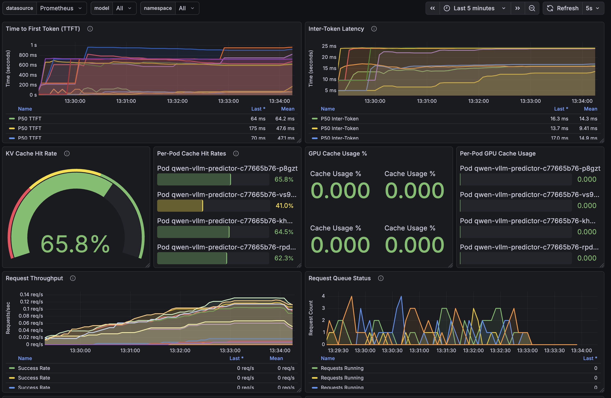
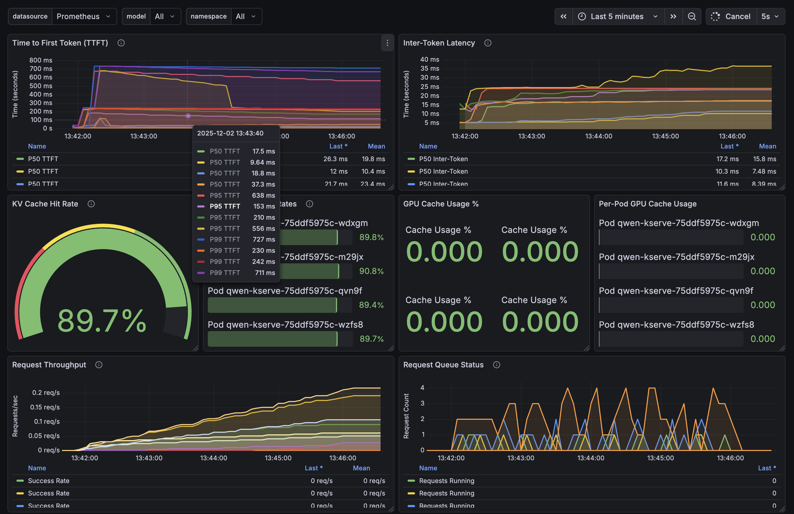

# Multi-Turn Conversation Benchmark Tool

A Python-based benchmarking tool for testing LLM inference performance with realistic multi-turn conversations. Designed to evaluate prefix caching efficiency and KV cache behavior in LLM deployments with llm-d.

**[Running on OpenShift?](#running-on-openshift)** - Use the pre-built container image.

## Features

- **Seed Document Based**: Uses real-world documents (code and text) as conversation starters
- **Document Type Detection**: Automatically classifies documents as CODE or TEXT and applies appropriate instructions
- **Multi-Turn Conversations**: Simulates realistic back-and-forth conversations with follow-up questions
- **Parallel Execution**: Multiple concurrent workers with random delays to simulate real user behavior
- **Prefix Caching Analysis**: Measures TTFT (Time to First Token) to evaluate cache hit rates
- **Comprehensive Statistics**: Per-turn analysis, document type breakdown, and speedup ratios

## Example Results

The following results were collected on an OpenShift cluster with 4 x NVIDIA L4 GPUs, running 11 concurrent conversations with 10 turns each.

### vLLM

```
Time to First Token (TTFT):
  Min:         50.13 ms
  Max:        850.20 ms
  Mean:       211.82 ms
  P50:        123.22 ms
  P95:        744.71 ms
  P99:        840.95 ms
```



Grafana dashboard image from vllm run, showing spikes in TTFT resulting in higher values for p95 and p99.  This dashboard also shows only 66% cache hits meaning a third of requests require more compute for prefill.

### llm-d

```
Time to First Token (TTFT):
  Min:         51.19 ms
  Max:        804.54 ms
  Mean:       120.98 ms
  P50:         92.09 ms
  P95:        271.60 ms
  P99:        674.21 ms
```



Grafana dashboard image from llm-d run, showing smoother results for TTFT, resulting in lower values for p95 and p99.  This dashboard shows 90% cache hits meaning only 10% of requests require using compute for prefill.

### Analysis

llm-d demonstrates significantly better and more consistent performance compared to vLLM, particularly in the higher percentiles:

| Metric | vLLM | llm-d | Improvement |
|--------|------|-------|-------------|
| Mean | 211.82 ms | 120.98 ms | **43% faster** |
| P50 | 123.22 ms | 92.09 ms | **25% faster** |
| P95 | 744.71 ms | 271.60 ms | **64% faster** |
| P99 | 840.95 ms | 674.21 ms | **20% faster** |

The most dramatic improvement is at P95, where llm-d is nearly 3x faster than vLLM. This indicates that llm-d's prefix-aware routing effectively directs requests to replicas that already have relevant KV cache entries, avoiding the expensive cold-start prefill operations that cause tail latency spikes in vLLM.


The tighter distribution of latencies in llm-d (P95 only 2.9x the P50, vs 6x for vLLM) demonstrates more predictable performance, which is critical for production workloads with SLA requirements.


## Requirements

```bash
pip install httpx
```

## Usage

### Basic Usage

```bash
python multi-turn-benchmark.py http://localhost:8000/v1
```

### Full Options

```bash
python multi-turn-benchmark.py <URL> [OPTIONS]

Arguments:
  URL                     Base URL of the LLM API (e.g., http://localhost:8000/v1)

Options:
  -d, --seed-documents    Directory containing seed documents (default: ./seed-documents)
  -c, --conversations     Number of concurrent conversations (default: 11)
  -t, --turns             Number of turns per conversation (default: 10)
  -m, --max-tokens        Maximum tokens per response (default: 500)
  -p, --parallel          Number of parallel workers (default: 4)
  --min-delay             Minimum delay between requests in seconds (default: 0.5)
  --max-delay             Maximum delay between requests in seconds (default: 2.0)
  --timeout               Request timeout in seconds (default: 120)
  -v, --verbose           Show response previews
```

### Examples

```bash
# Basic run with defaults
python multi-turn-benchmark.py http://localhost:8000/v1

# High concurrency test
python multi-turn-benchmark.py $LLM_URL --parallel 8 --min-delay 0.1 --max-delay 0.5

# Quick test with fewer turns
python multi-turn-benchmark.py $LLM_URL --conversations 5 --turns 3

# Custom documents directory
python multi-turn-benchmark.py $LLM_URL --seed-documents /path/to/documents
```

## Seed Documents

The tool uses documents from the `seed-documents/` directory. Documents are classified by file extension:

### Code Documents (`.py`, `.go`, `.rs`, `.tsx`, `.ts`, `.js`, `.sql`, `.java`, `.c`, `.cpp`, `.rb`)

Initial prompts like:
- "Review this code and identify any bugs or issues"
- "Add detailed comments to explain what each function does"
- "Refactor this code to improve readability"
- "Identify potential security vulnerabilities"

Follow-up prompts like:
- "The code still has issues. Can you look more carefully?"
- "Can you show me what the fixed code would look like?"
- "What about edge cases - are those handled properly?"

### Text Documents (`.md`, `.txt`, `.rst`, `.html`)

Initial prompts like:
- "Summarize the main points of this document"
- "Create a bulleted list of the key takeaways"
- "What are the main arguments or findings presented?"

Follow-up prompts like:
- "Can you make that summary longer and more detailed?"
- "That's too long. Can you make it more concise?"
- "What are the practical implications of these findings?"

## Running on OpenShift

A pre-built container image is available at `quay.io/hayesphilip/multi-turn-benchmark:0.0.1` with the benchmark script and seed documents included.

### Run as a Job

Create and apply the job manifest:

```yaml
apiVersion: batch/v1
kind: Job
metadata:
  name: multi-turn-benchmark
  labels:
    app: multi-turn-benchmark
spec:
  backoffLimit: 0
  ttlSecondsAfterFinished: 86400
  template:
    metadata:
      labels:
        app: multi-turn-benchmark
    spec:
      restartPolicy: Never
      containers:
        - name: benchmark
          image: quay.io/hayesphilip/multi-turn-benchmark:0.0.1
          args:
            - "http://your-llm-service.namespace.svc.cluster.local:8000/v1"
          resources:
            requests:
              cpu: "500m"
              memory: "256Mi"
            limits:
              cpu: "1"
              memory: "512Mi"
```

```bash
# Apply the job
oc apply -f openshift-job.yaml

# Watch the job status
oc get jobs -w

# View logs
oc logs -f job/multi-turn-benchmark

# Delete when done
oc delete job multi-turn-benchmark
```

### Customizing the Benchmark

Add additional arguments to the job:

```yaml
args:
  - "http://your-llm-service.namespace.svc.cluster.local:8000/v1"
  - "--conversations"
  - "20"
  - "--turns"
  - "5"
  - "--parallel"
  - "8"
```

### Quick Interactive Run

```bash
oc run benchmark-runner -it --rm \
  --image=quay.io/hayesphilip/multi-turn-benchmark:0.0.1 \
  --restart=Never \
  -- http://your-llm-service.namespace.svc.cluster.local:8000/v1
```

## Understanding the Output

### Key Metrics

| Metric | Description |
|--------|-------------|
| **TTFT** | Time to First Token - measures how quickly the model starts responding |
| **Total Request Time** | End-to-end time for the complete response |
| **Speedup Ratio** | First turn TTFT / Later turns TTFT - indicates prefix caching effectiveness |

### Example Output

```
================================================================================
BENCHMARK SUMMARY
================================================================================

Total time: 242.75s
Total requests: 110
Completed conversations: 11/11
Requests per second: 0.45

Time to First Token (TTFT):
  Min:         51.19 ms
  Max:        804.54 ms
  Mean:       120.98 ms
  P50:         92.09 ms
  P95:        271.60 ms
  P99:        674.21 ms

TTFT by Turn Number:
  Turn  1:     361.79 ms avg (11 requests)
  Turn  2:      83.43 ms avg (11 requests)
  Turn  3:      86.10 ms avg (11 requests)
  ...

First Turn vs Subsequent Turns (Prefix Caching Indicator):
  First turn avg:      361.79 ms
  Later turns avg:      94.22 ms
  Speedup ratio:         3.84x
```

### Interpreting Results

- **High Speedup Ratio (>2x)**: Prefix caching is working effectively. Later turns reuse cached KV values from previous turns.
- **Low Speedup Ratio (~1x)**: Prefix caching may not be effective, or cache is being evicted between requests.
- **Consistent TTFT across turns**: Good cache retention throughout the conversation.
- **Increasing TTFT on later turns**: May indicate cache pressure or eviction.

## Comparing vLLM vs llm-d

When comparing deployments:

| Scenario | Expected llm-d Advantage |
|----------|-------------------------|
| Many unique prefixes across replicas | llm-d routes similar prefixes to same replica |
| Multi-turn conversations | Both benefit, but llm-d optimizes replica selection |
| High concurrency | llm-d balances cache utilization across replicas |

## Troubleshooting

### Error 400 Bad Request

Usually indicates context length exceeded. Solutions:
- Reduce `--max-tokens` (e.g., `--max-tokens 200`)
- Reduce `--turns` (e.g., `--turns 5`)
- Ensure model has sufficient `--max-model-len` configured

### Connection Errors

- Verify the service URL is correct
- Check if the model pods are running: `oc get pods -n demo-llm`
- Test connectivity: `curl $LLM_URL/models`

### Slow Performance

- Reduce `--parallel` if overwhelming the service
- Increase `--min-delay` and `--max-delay` for more realistic pacing
- Check GPU utilization on model pods

